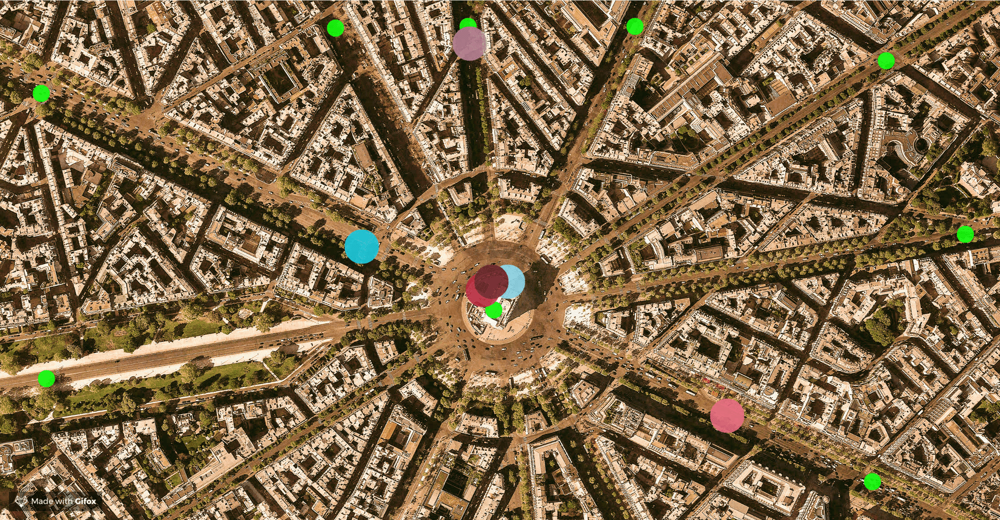

# CppNd-Traffic-Simulation-L3

## Summary
  

This is project Stage3.

Bsed on project stage2, this project is meant to add mutex to make Vehicle id output corecttely and protect some critical data.

  

## Dependencies for Buiding 

* cmake >= 2.8
  * All OSes: [click here for installation instructions](https://cmake.org/install/)
* make >= 4.1 (Linux, Mac), 3.81 (Windows)
  * Linux: make is installed by default on most Linux distros
  * Mac: [install Xcode command line tools to get make](https://developer.apple.com/xcode/features/)
  * Windows: [Click here for installation instructions](http://gnuwin32.sourceforge.net/packages/make.htm)
* OpenCV >= 4.1
  * The OpenCV 4.1.0 source code can be found [here](https://github.com/opencv/opencv/tree/4.1.0)
* gcc/g++ >= 5.4
  * Linux: gcc / g++ is installed by default on most Linux distros
  * Mac: same deal as make - [install Xcode command line tools](https://developer.apple.com/xcode/features/)
  * Windows: recommend using [MinGW](http://www.mingw.org/)
Windows: recommend using MinGW
  make `build` director in top location of project file, then do `make.. && make`, after build 
completed using command `./traffic_simulation` to run.

## Basic Build Instructions

1. Clone this repo.
2. Make a build directory in the top level directory: `mkdir build && cd build`
3. Compile: `cmake .. && make`
4. Run it: `./traffic_simulation`.

## Project Tasks

- **Task L3.1** : In class `WaitingVehicles`, safeguard all accesses to the private members `_vehicles`and `_promises` with an appropriate locking mechanism, that will not cause a deadlock situation where access to the resources is accidentally blocked.
- **Task L3.2** : Add a static mutex to the base class `TrafficObject` (called `_mtxCout`) and properly instantiate it in the source file. This mutex will be used in the next task to protect standard-out.
- **Task L2.3** : In method `Intersection::addVehicleToQueue` and in `Vehicle::drive()` ensure that the text output locks the console as a shared resource. Use the mutex `_mtxCout` you have added to the base class `TrafficObject` in the previous task. Make sure that in between the two calls to `std::cout` at the beginning and at the end of `addVehicleToQueue` the lock is not held.
